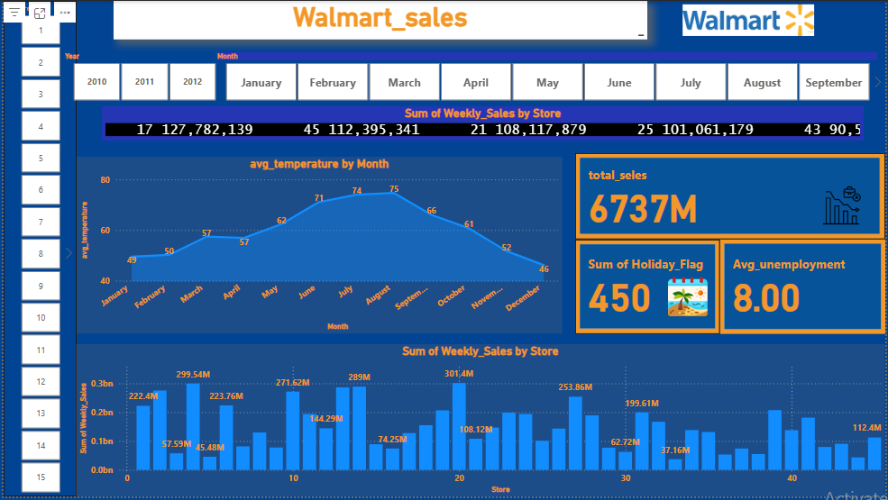

# walmart
# Retail Weekly Sales Dashboard

This repository contains a **Power BI dashboard** analyzing weekly sales data for Stores, along with relevant economic and environmental indicators.

---

## 📊 Project Description
The dashboard provides insights into **weekly sales trends**, **seasonal peaks**, and the impact of external factors such as:

- Holidays (`Holiday_Flag`)  
- Temperature (`Temperature`)  
- Fuel Prices (`Fuel_Price`)  
- Consumer Price Index (`CPI`)  
- Unemployment Rate (`Unemployment`)

The dataset covers weekly sales from early 2010 and allows analysis of both **normal weeks** and **peak holiday periods**.

---

## 🎯 Dashboard Features
- **Trend Analysis:** Visualizes weekly sales over time  
- **Seasonality Detection:** Highlights holiday periods and peak shopping weeks  
- **Factor Impact:** Shows correlation between sales and external variables (temperature, fuel price, CPI, unemployment)  
- **Forecasting Potential:** Prepares data for predictive modeling  

---

## 📝 Notes
- High sales values during holiday weeks (e.g., 26-Nov, 24-Dec) are **seasonal peaks**, not outliers.  
- These points are kept in the dataset to allow accurate forecasting and trend analysis.  
- Log transformation is recommended for modeling to handle large variations in weekly sales.

---
## 📸 Dashboard Preview
  

